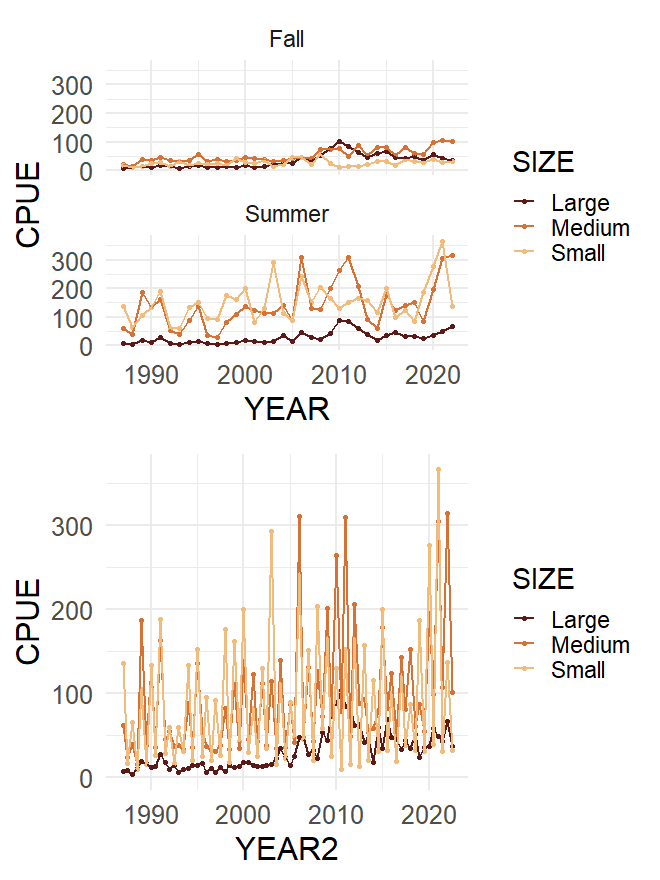

# Methods {#sec-methods}

Empirical dynamic modeling provides a robust, non-parametric framework for forecasting short-lived species that may exhibit complex, non-equilibrium, nonlinear dynamics [@rogers_hidden_2020; @dolan_age_2023; @tsai_predicting_2023]. Our methodology builds upon recent advancements in this field, specifically the Gaussian Process EDM (GP-EDM) estimator introduced by @munch_circumventing_2017.  This approach has proven highly effective for Gulf of America shrimp species [@tsai_predicting_2023], enabling the estimation of management benchmarks [@tsai_empirical_2024] that have been formally adopted for brown shrimp catch limits [@sedar87].  While previously published models have successfully captured environmental and biological dynamics, the Gulf shrimp fishery is heavily influenced by economic market conditions. Therefore, we expand the current GP-EDM framework to directly incorporate economic covariates. Our approach involves (1) developing a baseline EDM to describe the brown shrimp population with fishery removals (landings), (2) estimating size-specific harvest rates using observed ex-vessel and fuel prices, (3) re-fitting the base EDM with harvest rates estimated from ex-vessel and fuel prices, and (4) projecting economic scenarios with varying ex-vessel and varying fuel prices. This novel formulation allows for comprehensive economic scenario simulations, yielding integrated predictions of harvest rates and revenue alongside their impacts on the broader population.

## Stock Structure and Available Data {#sec-data}

The shrimp fishery in the southeastern United States (US) is among the most valuable in the nation. This fleet primarily targets penaeid shrimp, which are distributed throughout US and Mexican waters in this region. The US brown shrimp stock boundary extends from the US–Mexico border in the west through the northern Gulf of America waters (hereafter referred to as the Gulf) to approximately the Florida-Alabama state line.  The western boundary is primarily jurisdictional, while the eastern boundary is ecological [@craig2005spatial].  The brown shrimp range almost entirely encompasses that of white shrimp which are generally found in shallower water, while pink shrimp are mostly found in the eastern Gulf off the coast of Florida. These species are often caught together, but brown shrimp is the focus of this study. Shrimp market categories drive many aspects of the fishery, so we utilized size-structured and seasonally stratified data to appropriately capture their fast growth and seasonal drivers.  Brown shrimp were separated by size into market categories [Small (>67 tails per pound), Medium (67-31 tails per pound), and Large (<=30 tails per pound)], and by season of the year [Summer (May-August) and Fall (September-December, which also includes minimal landings from the following Winter, January-April)].

The Southeast Area Monitoring and Assessment Program (SEAMAP) trawl survey is a collaborative effort between federal, state, and university programs, designed to collect, manage, and distribute fishery-independent data throughout the Gulf. The survey operates in the Summer and Fall, where the Summer survey tracks new recruits to the brown shrimp population, and the Fall generally surveys what is left after most of the Gulf shrimp fishery has taken place (@fig-cpueG).  Small, Medium, and Large market categories referenced above were converted to millimeters Total Length (mm TL) for application to the SEAMAP brown shrimp data [Small (<115.6 mm TL), Medium (115.6-151.7 mm TL), and Large (>=151.8 mm TL)] [@sedar87].

{#fig-cpueG}

Commercial landings of brown shrimp were constructed using data from the US federal Gulf Shrimp System and state trip ticket programs.  Species-specific Gulf shrimp landings have been collected since the late 1950s, but landings data beginning in 1987 were utilized here to match the available fishery-independent index of abundance.  Landings from the Winter months (JFMA) were minimal, averaging just `r round(winter[winter$SEASON=='WINTER',]$percent*100,1)`\% of annual landings since 1987, and were added to the previous year's Fall (SOND) landings to match the seasonal timestep of the SEAMAP survey.  Brown shrimp landings have been collected since `r min(landings$YEAR)` and peaked in `r cpue_land_A[cpue_land_A$tailmp==max(cpue_land_A$tailmp),]$YEAR` with landings totaling `r round(max(cpue_land_A$tailmp),2)` million pounds of tails.  Landings were relatively stable through the mid-2000s and have been on a steady decline due to the increasing prevalence of aquaculture and associated reduction in global and domestic prices.  US domestic ex-vessel prices and expected profits strongly influence the Gulf fleet's decision to harvest, which has resulted in a larger standing stock in recent years [@liese_etal_2026, @sedar87].

## Gaussian-Process Empirical Dynamic Model Configuration {#sec-edm-methods}

Empirical dynamic modeling uses time-delay embedding to account for unobserved system variables [@takens_1981].  Specifically, lags of the observed time series reconstruct the dynamics of the full system to the extent allowed by time series length [@sugihara_nonlinear_1994; @sugihara_detecting_2012; @munch_circumventing_2017; @munch_recent_2022].  Lags of fishery-independent SEAMAP abundance indices were used to reconstruct the dynamics of the brown shrimp population using the [GP-EDM package (v.0.0.0.9010)](https://github.com/tanyalrogers/GPEDM).

The brown shrimp population was modeled as

$$
y_t=f(S_{t-1},...,S_{t-m})+\epsilon_t
$$

where $S_t$ is ‘escapement’ (defined below) at seasonal time step $t$ across $m$ lags, $\epsilon_t∼Normal(0,V_e)$  is process noise, and $f$ is an unknown function to be determined from the data.  The delay embedding map $f$ was approximated using Gaussian process regression. The escapement, $S_t= I_t-qC_t$ includes fishery independent SEAMAP CPUE $I_t$ reduced by removals, $C_t$ (catch or landings) scaled by an estimated ‘catchability’ parameter $q$ to reflect the abundance of shrimp that remained after fishing. The catchability parameter translates units of landings (million pounds of tails, mp) into survey units (number of individuals per trawl hour). 

To estimate the delay embedding map, $f$, in our Bayesian framework, we assign it a Gaussian Process prior with mean zero and covariance function $\Sigma$, i.e.,

$$
P[f│\Phi,\tau] \sim GP(0,\Sigma)
$$

In keeping with previous applications of GP-EDM, we used a squared exponential covariance function 

$$
\Sigma[f_t,f_{t^'}] = \tau  exp [ - \Sigma_{i=1}^{m} \phi_{i}(S_{t-i}-S_{t'-i})^2 ]
$$

where $\Phi=\phi_1,...,\phi_m$ are the inverse length scale parameters associated with each lag $m$, $\tau$ the pointwise prior variance, and $f_t,f_{t^'}$ represent the delay embedding map evaluated at times $t$ and $t' \in T$ where $T$ is the time series length [@munch_recent_2022].  Following standard GP-EDM practice, we used weakly informative priors for the variance hyperparameters $V_e$, $\tau$, where $P[V_e/2var(y)] = P[\tau/2var(y)] \sim Beta(1.1,1.1)$, which sets the total prior uncertainty in $f$ to twice the variance in the data.  Note that setting $\phi_j=0$ removes the $j^{th}$ lag of escapement from the model.  To promote a parsimonious model, we used half-normal priors with variance $\pi/2$, $\phi_j \sim HalfNormal(\pi/2)$, such that $E(\phi_j)=1$ and the mode =0.  Further details on GP prior specification for EDM variance and length scale parameters can be found in @munch_circumventing_2017.

The embedding dimension ($E=m+1$), inverse length scale parameters $\Phi$, and covariance function $\Sigma$ jointly control the complexity of the shape of $f$. Each model input incorporates an additional dimension of predictor space, and the associated inverse length scale parameter $\phi_m$ defines the wiggliness of the function in the direction of that input. Low values of $\phi$ indicate stiff and mostly linear relationships, and large values of $\phi$ indicate a higher degree of nonlinearity.  A model with a single input and large $\phi_m$ would have many degrees of freedom, while a model with many inputs but all $\phi_m$ close to 0 would have relatively few degrees of freedom [@tsai_empirical_2024]. As in other nonparametric regression approaches, approximate degrees of freedom are obtained using $df \approx Tr(S'S)$ where $S=\Sigma_m (\Sigma_m + V_eI)^{-1}$ is the ‘smoother matrix’ obtained by evaluating the covariance function over the observed data.  Prior to fitting EDM models, all input data are standardized to a mean of 0 and standard deviation of 1.  

The GP-EDM framework allows for hierarchical model structures, meaning that multiple time series (e.g., from different populations or different age classes) can be incorporated into a single model with the assumption that these time series share similar (but not necessarily identical) dynamics [@rogers_hidden_2020; @dolan_age_2023]. For brown shrimp, we constructed hierarchical models using the time series for three size classes. The dynamic correlation hyperparameter $\rho_{D} \in [0,1]$ defines the degree to which the dynamics of the different categories (in this case, size classes) are correlated in a hierarchical GP-EDM.  The categories respond identically to predictors when $\rho_{D}=1$ and independently when $\rho_{D}=0$. Categories in hierarchical models share the same embedding parameters and inverse length scale parameters (this includes models with $\rho_{D}=0$), so the hierarchical model is more constrained than models where each category is fit independently.

As a baseline GP-EDM model for brown shrimp, we used the ‘best model configuration’ from the recently accepted brown shrimp stock assessment [@sedar87], which performed extensive model selection. This best model used 3 size classes (Large, Medium, Small), 5 lags of escapement, timesteps defined in 2 seasons, and used the log growth rate relative to escapement ($log(I_{t}/(I_{t-1}-qC_{t-1}))$) as the response variable $y_t$ (backtransforming to abundance index units before evaluating goodness of fit statistics).

Goodness of fit was measured through the estimation of $R^2$.  In- and out-of-sample fit statistics were reported, where out-of-sample statistics were generated using the 'sequential' option in the GP-EDM package.  This method makes a prediction for each time point in the training data, which excludes all future time points back to the beginning of the dataset, to estimate hyperparameters.  This is a better indicator of forecast ability when compared to standard 'leave time out' methodology (albeit yields a lower $R^2$ fit statistic).

Parameters estimated and priors specified in GP-EDM are defined below.  

- $\phi_1:\phi_{m}$ - length scale parameters for $1:m$ where $m$ is the total lags; priors are set such that the expected number of local extrema for each $\phi_m$ is 1 [@munch_circumventing_2017]
- $V_e$ - process variance
- $\tau$ - pointwise prior variance in $f$
- $\rho_{D}$ - dynamic correlation between populations where values range from 0 to 1, with 0- independent no correlation and 1- identical dynamics
- $q$- catchability scalar that translates the units of landings into units of survey CPUE

The relative magnitude of the pointwise prior variance $\tau$ and process noise $V_e$ gives information on how important the function is relative to the noise. Process variance is represented as a percentage of the total variance, whereas the pointwise prior variance cannot be directly translated to variance percentage because it interacts with the length scale parameters. If the model is purely deterministic, $V_e=0$ and $\tau\approx1$.  If the model is not fitting the data well, $\tau$ is small and the process variance is close to 1.  

## Linking Economic Conditions to Harvest Rate and Removals

Traditionally, covariates in EDM are incorporated directly as additional predictors (inputs) in the nonparametric model [@dixon_episodic_1999; @deyle_generalized_2011; @munch_recent_2022]. In the case of brown shrimp, economic conditions have been the central driver of the domestic fishery, which in turn influences the amount of shrimp left in the water. Because we are explicitly incorporating removals in our model, we developed an alternative formulation where economic covariates are incorporated specifically via their effects on removals.

Ex-vessel shrimp prices and fuel prices are central determinants of the potential profitability of the shrimp fleet through their anticipated effects on revenue and cost, respectively. Both shrimp and fuel are globally traded commodities, and hence the Gulf's prices closely track the U.S. prices and are mostly exogenous to the Gulf's shrimp fishery [@asche_global_2022]. Particular to fisheries, the producers cannot choose their output level directly, but can only select their input levels such as fishing effort. Prices affect their decision to trawl and, collectively, determine the harvest rate applied to the population. The goal here was to link shrimp and fuel prices to harvest rates in the baseline model, allowing us to potentially improve the predictive capability of the model, as well as simulate the impacts of various economic scenarios across landings and population.  To do this, we calculated the size-specific harvest rate at each seasonal time step (two per year) and modeled harvest rate as a function of economic conditions, specifically the size-specific ex-vessel price of shrimp and seasonal cost of fuel. We calculated average shrimp prices by size and season from landings data and adjusted them for inflation to 2022 dollars, using the BEA implicit price deflator for GDP. To account for the fluctuations in the price of fuel (without introducing multiple regional, diesel, tax, and retail/wholesale issues), we used the monthly U.S. EIS Administration, No. 2 Heating Oil Prices: New York Harbor [MHOILNYH] to derive a real, seasonal-average fuel price index, in 2022 dollars.

Size-classes were defined based on market categories defined above: Large, Medium, and Small.  Size-specific harvest rate, $U_{t,size}$, was defined as the proportion of the population removed in biannual time step $t$ 

$$
U_{t,size}=\dfrac{qC_{t,size}}{I_{t,size}}
$$

where $C_{t}$ is observed removals in time $t$ scaled by model-estimated catchability $q$ divided by the index of abundance $I_{t}$. Harvest rate, constrained to values between 0 (no harvest) and 1 (harvesting the entire population) was modeled as a function of the log-transformed cost of fuel ($F_{t}$) and log-transformed ex-vessel price ($P_t$) allowing for different intercepts and slopes for each size class

$$
\hat U_{t,size}=\beta_{0,size} + \beta_{1}log(F_{t}) +\beta_{2,size}log(P_{t,size})
$$

where $\beta_0$ are intercepts and $\beta_2$ are slopes that are specific to each size class, while $\beta_1$ for fuel is estimated relative to all data combined. Substituting $\hat U_t$ for $U_t$ in our original definition of harvest rate (and dropping size subscripts for brevity), we can re-define removals $qC_t$ in terms of fuel- and price-driven effort as:

$$
qC_{t} =I_{t} \hat U_t
$$

We redefined our GP-EDM model by substituting the observed removals, $qC_t$, with the index $I_t$ directly, multiplied by the fuel- and price-driven harvest rate, $\hat U_t$, replacing escapement $S_t=I_t-qC_t$ with $\hat S_t=I_t(1- \hat U_t)$ and re-fitting the GP under the same prior specification to obtain a model $y_t=\hat f (\hat S_{t-1},...,\hat S_{t-m}) + \epsilon_{t}$. 

This formulation of GP-EDM was applied to an identical model configuration as the ‘best configuration’ identified in SEDAR87 (i.e. hierarchical by size, 5 lags of escapement, seasonal) and hyperparameters $V_{e}, \tau, \Phi$ were re-estimated.

## Projecting Economic Scenarios

With this framework linking population removals to ex-vessel and fuel prices, we can simulate economic scenarios and realistically project resulting fishery landings, revenue, and population sizes. First, the performance of the economic GP-EDM fitted with price-predicted harvest rates was compared to the baseline GP-EDM accepted for management (which used landings data directly). Projections are conducted by specifying a harvest rate and iteratively replacing the estimated survivorship within the EDM formulation and dropping the furthest lagged data (e.g., $\hat S_{t-m}$) to estimate the survivorship in the next time step (e.g., $\hat S_{t+1}$).

$$
\hat S_{t+1} = \hat f(\hat S_{t},...,\hat S_{t-(m-1)})+e_t
$$

The stock assessment and price-derived models were both projected using respective harvest rates from 2020-2022 averages (derived from landings for the former, and from prices for the latter). Performance was compared using $R^2$ (within each size class and across all size classes where size classes are standardized to have zero mean and unit variance). Once the model incorporating price in the escapement term was validated, additional scenarios were investigated.  Scenarios for ex-vessel price projections were defined as (1) baseline [2020-2022 average price], (2) continued competition with farmed imports [25\% decrease in price], (3) tariff-induced increase [25\% increase in price], and (4) premium-label product increase [50\% increase in price].  These ex-vessel price scenarios were each paired with fuel price projections defined as (1) baseline [2020-2022 average price], (2) \$1.50 per gallon, and (3) \$4.00 per gallon, resulting in a total of 12 economic scenarios. Additionally, projections were run using the harvest rate at brown shrimp maximum sustainable yield (MSY) identified in the latest stock assessment for sustainability comparison.

<!-- GP-EDM is projected by sequentially incorporating the predicted timestep as the most recent input into the model.  -->

